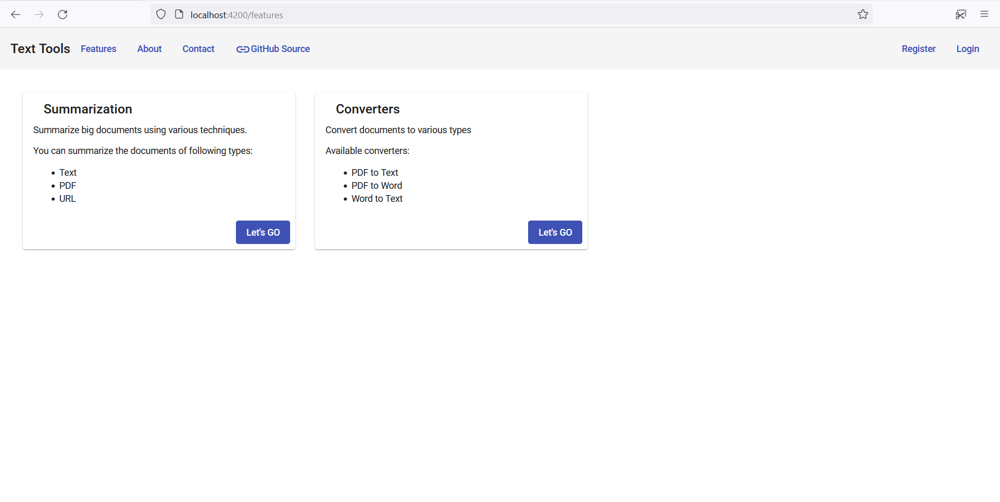
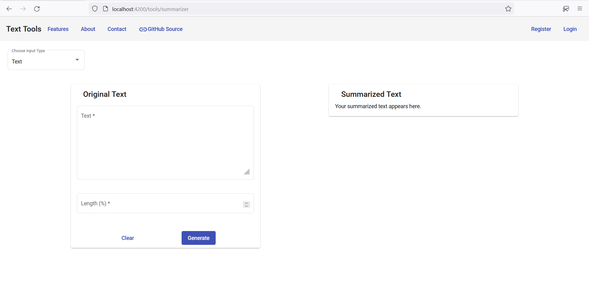

# Quick Reads

Quickly summarize big news articles and science papers with one step.

This project uses Angular, Flask, and SQLite.


## Screenshots


<br/>

<br/>

<br/>

<br/>

## Installation

### Configure Frontend
- This project uses Angular for frontend, so you need to install Angular CLI. Run the command below to install Angular CLI.

```bash
npm install --location=global @angular/cli
```

- Next you need to add Material UI library to your project. Run the command below to install Angular Material UI.
```bash
ng add @angular/material
```

- For responsive layout, this project uses Flex Layout. To install it, run
```bash
npm install @angular/flex-layout @angular/cdk
```


### Configure Backend
- You need to have Python 3.8 or above.
- Create a virtual Environment with the virtualenv package. In case you don't have virtualenv on your machine, you can install with:
**Note:** Install virtualenv with administrative privileges.
```bash
pip install virtualenv
```
- Create a virtual environment using below command:
```bash
virtualenv <env_name>
For example, virtualenv venv
```
- Activate the virtual environment
```bash
.\venv\Scripts\activate.ps1
```
- Install the required packages from **requirements.txt** file.
- Open a terminal in the *backend* folder and run the command:
```bash
python main.py
```

- This will start the server.
- Now open a terminal in the *frontend* folder. Start the frontend server using the command below:
```bash
ng serve
```